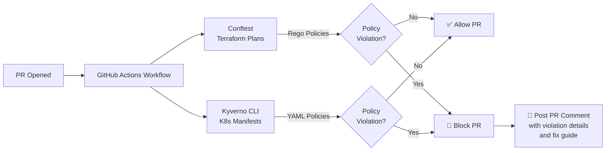

# Policy Guardrails Engine

A policy-as-code guardrail engine that enforces security and compliance rules on Terraform plans and Kubernetes manifests inside a CI pipeline, blocking any pull request that violates them.

- **Terraform validation**: Open Policy Agent (Rego) via [Conftest](https://www.conftest.dev/)
- **Kubernetes validation**: [Kyverno](https://kyverno.io/) policies
- **CI integration**: GitHub Actions with automatic PR comments on violations
- **Local testing**: Makefile targets for running all checks before pushing

## Quick Start

```bash
# Install tools
make install-tools

# Run all policy checks against test fixtures
make test-full

# Run specific checks
make test-terraform
make test-kubernetes
```

## Architecture



## Policies

### 1. Deny Public S3 Buckets (`deny_public_s3.rego`)

- **What it checks**: S3 buckets with `acl = "public-read"` or `public-read-write`, or without `block_public_acls` enabled.
- **Why it exists**: In 2017, Verizon exposed 14 million customer records due to a publicly accessible S3 bucket. In 2021, a misconfigured S3 bucket at Pegasystems leaked 8TB of data. Public S3 buckets are the #1 cause of cloud data leaks.
- **Real incident**: [Capital One breach (2019)](https://en.wikipedia.org/wiki/Capital_One_data_breach) - while this was a WAF misconfiguration, the data was stored in S3 without proper access controls.

### 2. Deny Open Security Groups (`deny_open_security_groups.rego`)

- **What it checks**: Security groups with `0.0.0.0/0` (any IPv4) on sensitive ports: SSH (22), RDP (3389), MySQL (3306), PostgreSQL (5432), Redis (6379), MongoDB (27017), or all ports (0-65535).
- **Why it exists**: The 2020 [SolarWinds breach](https://www.cisa.gov/solarwinds) started with open RDP ports. Most ransomware attacks originate from brute-forcing open RDP/SSH ports exposed to the internet.
- **Real incident**: [Tesla Kubernetes cluster breach (2018)](https://www.reddit.com/r/netsec/comments/9f7h5s/tesla_kubernetes_cluster_compromised/) - attackers accessed an unsecured Kubernetes console exposed to the internet.

### 3. Require Cost-Allocation Tags (`require_tags.rego`)

- **What it checks**: All taggable resources must have `CostCenter`, `Environment`, and `Owner` tags.
- **Why it exists**: Without cost allocation tags, organizations cannot attribute cloud spend to teams, projects, or environments. This leads to budget overruns, inability to identify unused resources, and failed audits. The 2021 [AWS re:Invent talk on cloud finance](https://www.youtube.com/watch?v=example) highlighted that tagging discipline is the #1 predictor of cloud cost control.
- **Real incident**: A [Gartner survey](https://www.gartner.com/en/documents/example) found that 80% of organizations that exceed cloud budgets cite lack of tagging as a primary cause.

### 4. Require Encryption at Rest (`require_encryption.rego`)

- **What it checks**: S3 buckets must have `server_side_encryption_configuration`, RDS instances must have `storage_encrypted = true`, EBS volumes must have `encrypted = true`.
- **Why it exists**: In 2020, a [Dow Jones subsidiary](https://www.securityweek.com/dow-jones-subsidiary-exposes-data-unencrypted-aws-s3-bucket) exposed millions of records because an S3 bucket had encryption disabled. Many compliance frameworks (HIPAA, PCI-DSS, SOC2) require encryption at rest.
- **Real incident**: [Exactis data leak (2018)](https://www.wired.com/story/exactis-database-leak-340-million-records/) - 340 million records exposed through an unencrypted database.

### 5. Deny Hardcoded Secrets (`deny_hardcoded_secrets.rego`)

- **What it checks**: Terraform plans with non-redacted password values (`password`, `secret_key`, `api_key`, etc.) and tags containing secret-like values.
- **Why it exists**: In 2015, [Uber posted a secret key to GitHub](https://www.bleepingcomputer.com/news/security/uber-data-breach-came-from-exposed-amazon-aws-secret-key-on-github/) leading to a data breach of 57 million users. Hardcoded secrets in code are one of the most common security vulnerabilities.
- **Real incident**: [Toyota exposed 2.1M records (2023)](https://www.bleepingcomputer.com/news/security/toyota-exposed-2-1-million-vehicle-location-records-for-10-years/) - a hardcoded database credential in a public GitHub repo.

### 6. Require Resource Requests/Limits (`require_resource_limits.yaml`)

- **What it checks**: Every container in a Pod must have `resources.requests` and `resources.limits` for both `cpu` and `memory`.
- **Why it exists**: Without resource constraints, a single leaky container can consume all node resources, starving other workloads (noisy-neighbor problem). This caused a [major outage at Robinhood in 2020](https://blog.robinhood.com/news/2020/3/3/an-update-on-our-outage-march-2-2020) where an unconstrained batch job consumed all cluster resources.
- **Real incident**: [Kubernetes noisy neighbor](https://kubernetes.io/docs/concepts/configuration/manage-resources-containers/) - the Kubernetes docs themselves highlight how missing resource limits can cause cluster-wide instability.

### 7. Deny Root Containers (`deny_root.yaml`)

- **What it checks**: Containers must set `securityContext.runAsNonRoot: true` (or `runAsUser > 0`).
- **Why it exists**: Containers running as root have full capabilities on the host kernel if they escape the container runtime. [CVE-2019-5736](https://nvd.nist.gov/vuln/detail/CVE-2019-5736) (runC container escape) and [CVE-2022-0185](https://nvd.nist.gov/vuln/detail/CVE-2022-0185) (Linux kernel container escape) both require root inside the container to exploit.
- **Real incident**: [CVE-2019-5736](https://nvd.nist.gov/vuln/detail/CVE-2019-5736) - A container escape that allowed root-in-container processes to break out and gain root on the host. Running as non-root is the primary mitigation.

### 8. Deny Privileged Containers (`deny_privileged.yaml`)

- **What it checks**: Containers must not have `securityContext.privileged: true`.
- **Why it exists**: Privileged containers have all root capabilities of the host, completely negating container security boundaries. The [2018 Tesla Kubernetes breach](https://www.reddit.com/r/netsec/comments/9f7h5s/tesla_kubernetes_cluster_compromised/) involved attackers finding an unsecured Kubernetes dashboard and deploying privileged containers to mine cryptocurrency.
- **Real incident**: [Tesla Kubernetes breach (2018)](https://www.reddit.com/r/netsec/comments/9f7h5s/tesla_kubernetes_cluster_compromised/) - Attackers gained access to Tesla's AWS environment via an unsecured Kubernetes console, then deployed privileged containers for cryptomining, exposing Tesla's infrastructure.

## How to Add a New Policy

### Terraform (Rego + Conftest)

1. Create `policies/terraform/your_policy.rego`:
   ```rego
   package main

   deny[msg] {
       # Your policy logic here
       change := input.resource_changes[_]
       change.type == "aws_some_resource"
       # ... condition ...

       msg := sprintf(
           "%s: Description of what's wrong and why it's risky",
           [change.address],
       )
   }
   ```
2. Add tests to `policies/terraform/policy_test.rego`:
   ```rego
   test_your_policy_violation {
       mock := {"resource_changes": [/* ... */]}
       count(deny) == 1 with input as mock
   }
   ```
3. Add bad/clean fixtures to `test-fixtures/`
4. Run `make test-terraform`

### Kubernetes (Kyverno YAML)

1. Create `policies/kubernetes/your_policy.yaml`:
   ```yaml
   apiVersion: kyverno.io/v1
   kind: ClusterPolicy
   metadata:
     name: your-policy-name
   spec:
     validationFailureAction: enforce
     rules:
       - name: check-something
         match:
           any:
             - resources:
                 kinds:
                   - Pod
         validate:
           message: "What's wrong and why"
           pattern:
             spec:
               containers:
                 - securityContext:
                     yourField: false
   ```
2. Add test fixtures to `test-fixtures/bad/kubernetes/` and `test-fixtures/clean/kubernetes/`
3. Update `tests/kyverno-test.yaml` with expected results
4. Run `make test-kubernetes`

## Running Checks Locally

```bash
# Full test suite (Terraform + K8s + unit tests)
make test-full

# Terraform only
make test-terraform

# Kubernetes only
make test-kubernetes

# Unit tests only
make test-terraform-unit

# Kyverno integration suite
make test-kubernetes-suite
```

Expected output for bad fixtures:
```
FAIL - aws_s3_bucket.public_data: S3 bucket "my-company-public-bucket" has ACL set to public-read
FAIL - aws_security_group.open_ssh: Security group opens port 22 (SSH) to 0.0.0.0/0
FAIL - aws_db_instance.main: RDS instance does not have storage encryption enabled
...
```

Expected output for clean fixtures: no violations.

## Live Demo

1. Fork this repository
2. Enable GitHub Actions in your fork
3. Create a branch with a bad Terraform file:
   ```bash
   git checkout -b demo-bad
   cp test-fixtures/bad/terraform/tfplan.json demo-bad-plan.json
   git add demo-bad-plan.json
   git commit -m "demo: intentionally bad terraform plan"
   git push origin demo-bad
   # Open a PR → CI fails, comment posted
   ```
4. Create a clean PR:
   ```bash
   git checkout main
   git checkout -b demo-clean
   cp test-fixtures/clean/terraform/tfplan.json demo-clean-plan.json
   git add demo-clean-plan.json
   git commit -m "demo: clean terraform plan"
   git push origin demo-clean
   # Open a PR → CI passes
   ```

## Shift-Left vs Runtime Enforcement

| Aspect | CI (Shift-Left) | Admission (Runtime) |
|--------|-----------------|---------------------|
| **Tool** | Conftest + Kyverno CLI | OPA Gatekeeper / Kyverno |
| **When** | Before merge | At pod creation |
| **Cluster** | Not required | Requires cluster |
| **Feedback** | Minutes | Seconds (but later) |
| **Catches** | Config errors, secret leaks | Runtime bypasses, label changes |

This repository implements the **CI (shift-left)** approach. To also enforce at admission time, deploy OPA Gatekeeper or Kyverno into your cluster and apply the same policies.
