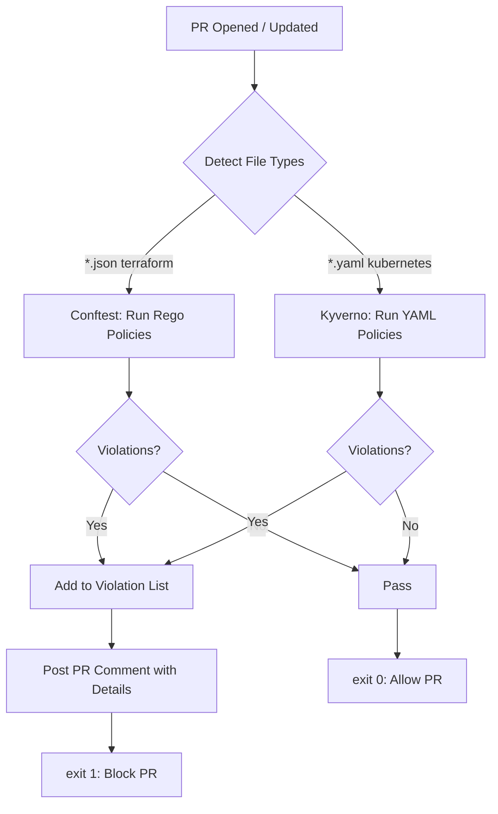

# Architecture

## Overview

```
                    ┌─────────────────────────────────────────────────────────┐
                    │                   GitHub Pull Request                    │
                    └──────────────┬──────────────────────────────┬───────────┘
                                   │                              │
                                   ▼                              ▼
                    ┌───────────────────────┐      ┌───────────────────────────┐
                    │  Terraform .tf / JSON  │      │  Kubernetes Manifests     │
                    │  (tfplan.json)         │      │  (.yaml / .yml)           │
                    └───────────┬───────────┘      └─────────────┬─────────────┘
                                │                                │
                                ▼                                ▼
                    ┌───────────────────────┐      ┌───────────────────────────┐
                    │     Conftest + OPA    │      │     Kyverno CLI           │
                    │   (Rego policies)     │      │   (YAML policies)         │
                    │                       │      │                           │
                    │  • deny_public_s3     │      │  • require_resource_limits│
                    │  • deny_open_sg       │      │  • deny_root              │
                    │  • require_tags       │      │  • deny_privileged        │
                    │  • require_encryption │      └─────────────┬─────────────┘
                    │  • deny_secrets       │                    │
                    └───────────┬───────────┘                    │
                                │                                │
                                ▼                                ▼
                    ┌─────────────────────────────────────────────────────────┐
                    │                  Aggregate Results                      │
                    └──────────────┬──────────────────────────────┬───────────┘
                                   │                              │
                          PASS ✅  │                        FAIL 🚫 │
                                   ▼                              ▼
                    ┌───────────────────────┐      ┌───────────────────────────┐
                    │  PR comment: ✅ All   │      │  PR comment: 🚫 List all  │
                    │  checks passed         │      │  violations + fix guide   │
                    └───────────────────────┘      └───────────────────────────┘
                                                              │
                                                              ▼
                                                  ┌───────────────────┐
                                                  │  Build FAILED     │
                                                  │  PR cannot merge  │
                                                  └───────────────────┘
```

## Shift-Left vs Runtime Enforcement

```
                    ┌────────────────────────────────────────────────────────┐
                    │          SHIFT-LEFT (CI)         │   RUNTIME (ADMIT)  │
                    ├──────────────────────────────────┼────────────────────┤
                    │  Conftest + Kyverno CLI          │  OPA Gatekeeper    │
                    │                                   │  or Kyverno        │
                    │  Runs on PR before merge         │  Runs at pod       │
                    │                                   │  creation time     │
                    │  Catches config errors early      │  Catches runtime   │
                    │                                   │  bypasses          │
                    │  Fast feedback (< 1 min)          │  Slower (in-cluster│
                    │                                   │  webhook)          │
                    │  No cluster required              │  Requires cluster  │
                    └──────────────────────────────────┴────────────────────┘
```

## Policy Decision Flow



## Why This Architecture?

1. **Conftest for Terraform** - Conftest wraps OPA/Rego and provides a simple CLI for evaluating policies against structured data (JSON plans). No need to run a full OPA server.

2. **Kyverno for Kubernetes** - Kyverno uses Kubernetes-native YAML policies instead of Rego, making them more accessible to teams already familiar with K8s manifests. The Kyverno CLI allows running these policies in CI without a cluster.

3. **PR Comments** - Posting violations directly on the PR provides immediate, contextual feedback to developers where they're already working.

## Directory Structure

```
policy-guardrails/
├── policies/
│   ├── terraform/         # Rego policies for Terraform (Conftest)
│   └── kubernetes/        # YAML policies for K8s (Kyverno)
├── test-fixtures/
│   ├── bad/               # Intentionally violating configs
│   └── clean/             # Compliant configs
├── tests/                 # Integration test manifests
├── .github/workflows/     # CI pipeline definitions
├── docs/                  # Documentation
└── Makefile               # Local development commands
```

## Adding a New Policy

### Terraform (Conftest/Rego)
1. Create a new `.rego` file in `policies/terraform/`
2. Define a `deny[msg]` or `warn[msg]` rule in the `main` package
3. The `msg` string should include the resource address and risk explanation
4. Add test cases to `policy_test.rego`
5. Add test fixtures to `test-fixtures/bad/` and `test-fixtures/clean/`
6. Run `make test-terraform` to verify

### Kubernetes (Kyverno)
1. Create a new `.yaml` policy in `policies/kubernetes/`
2. Define match conditions and validation rules
3. Add test expectations to `tests/kyverno-test.yaml`
4. Add test fixture manifests
5. Run `make test-kubernetes` to verify
